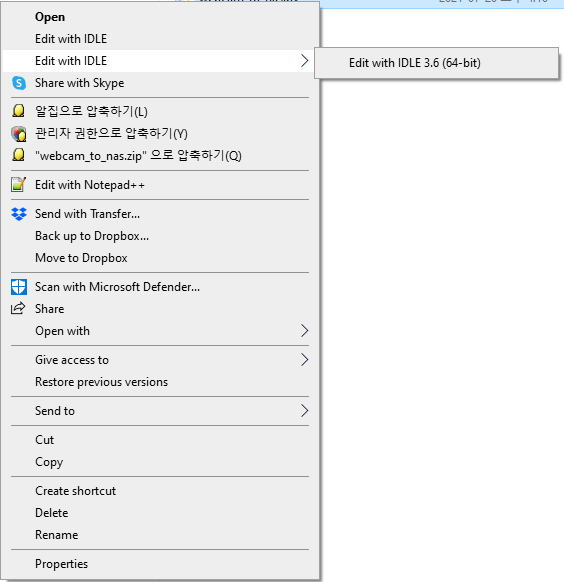

# NAS Code

## Overview

이 폴더에는 다음과 같은 기능을 수행하는 코드들이 담겨있습니다. 

1. 세미나 실의 웹캠 비디오 파일을 토게피 NAS에 전송 (`webcam_to_nas.py`)
2. 라운지의 웹캠 비디오 파일을 토게피 NAS에 전송 (`lounge_to_nas.py`)

## webcam_to_nas.py

### 코드  설명

* 디렉토리 위치: `C:\Users\CDSN Lab\Desktop\webcam_to_nas`
* `webcam_to_nas.py`: 웹캠 비디오 파일을 NAS로 업로드해주는 파일로 Python 3 기준으로 작성되었으며 두가지 모드를 지원합니다.
  1. `C:\Users\cdsn\RecordFiles`안에 저장되있는 비디오 파일들을 하루를 주기로 NAS에 업로드하는 모드
     * 일정 시간을 주기로 날짜가 변화했는지 판정이후, 날짜가 변했을 경우, 전날의 비디오 파일들을 NAS에 업로드 (ex. 2021.07.20에서 2021.07.21로 날짜가 변한 것을 감지한 이후, 2021.07.20에 해당하는 비디오 파일을 업로드)
     * NAS의 `/volume1/N1SeminarRoom825` 폴더에 비디오 파일들을 저장
     * 비디오 파일 업로드한 이후 최신 3일간의 데이터를 제외한 나머지 비디오 파일을 삭제
     * 위의 과정을 반복
  2. `C:\Users\cdsn\RecordFiles`안에 저장되있는 폴더 중 원하는 날짜의 폴더를 NAS에 업로드하는 모드
     * 해당 코드와 같은 디렉토리에 위치한 `day_list.txt` 파일에 기록한 날짜들에 해당하는 비디오 파일들을 NAS에 업로드 (ex. 20210719와 20210720을 기록한 경우, 2021.07.19와  2021.07.20에 해당하는 비디오 파일들이 업로드)
* `nas_info.json`: NAS의 정보를 담고 있는 json 파일
* `day_list.txt`: `webcam_to_nas.py`의 두번째 모드를 사용할때 사용하는 날짜의 리스트를 작성해두는 텍스트 파일

### 사용 방법 (1) 첫번째 모드

1. `C:\Users\CDSN Lab\Desktop\webcam_to_nas`안에 위치한 `webcam_to_nas.py`를 오른쪽 마우스로 클릭한다. 

2. 등장한 메뉴창의 위에서 세번째인 "Edit with IDLE->Edit with IDLE 3.6 (64-bit)" 버튼을 클릭한다.

   

3. `webcam_to_ans.py`가 열린 IDLE 창의 메뉴 중 "Run->Run Module" 버튼을 클릭한다.

   

4. Python 스크립트가 실행되고 "select the mode (0: quit, 1: webcamDataToNASDay, 2: uploadDays)" 텍스트가 등장한 이후 '1'을 입력하고 엔터버튼을 누른다.  

   

### 사용방법 (2) 두번째 모드

1. `C:\Users\CDSN Lab\Desktop\webcam_to_nas`안에 위치한 `day_list.txt`를 열어 업로드를 원하는 비디오 파일들의 날짜를 입력하고 저장한다.

   * 날짜는 yyyymmdd 형식으로 여덟글자로 작성한다. (ex. 2021.07.20인 경우, 20210720으로 입력)

   * 날짜가 두개 이상인 경우, '\n'(엔터)로 날짜를 구분한다. 

     * ex. 2021.07.18와  2021.07.19에 해당한 비디오 파일을 업로드할 경우

     

2. `C:\Users\CDSN Lab\Desktop\webcam_to_nas`안에 위치한 `webcam_to_nas.py`를 오른쪽 마우스로 클릭한다. 

3. 등장한 메뉴창의 위에서 세번째인 "Edit with IDLE->Edit with IDLE 3.6 (64-bit)" 버튼을 클릭한다.

   * 위의 이미지 참고

4. `webcam_to_ans.py`가 열린 IDLE 창의 메뉴 중 "Run->Run Module" 버튼을 클릭한다.

   * 위의 이미지 참고

5. Python 스크립트가 실행되고 "select the mode (0: quit, 1: webcamDataToNASDay, 2: uploadDays)" 텍스트가 등장한 이후 '2'을 입력하고 엔터버튼을 누른다.  

   * 위의 이미지 참고

## lounge_to_nas.py

### 코드  설명

* 디렉토리 위치: `C:\Users\cdsn\Desktop\lounge_to_nas`
* `lounge_to_nas.exe`: 웹캠 비디오 파일을 NAS로 업로드해주는 파일로 Python 3 기준으로 작성되었으며 두가지 모드를 지원합니다.
  1. `C:\Users\cdsn\AppData\LocalLow\RecordFiles`안에 저장되있는 비디오 파일들을 하루를 주기로 NAS에 업로드하는 모드
     * 일정 시간을 주기로 날짜가 변화했는지 판정이후, 날짜가 변했을 경우, 전날의 비디오 파일들을 NAS에 업로드 (ex. 2021.07.20에서 2021.07.21로 날짜가 변한 것을 감지한 이후, 2021.07.20에 해당하는 비디오 파일을 업로드)
     * NAS의 `/volume1/N1Lounge8F` 폴더에 비디오 파일들을 저장
     * 비디오 파일 업로드한 이후 최신 3일간의 데이터를 제외한 나머지 비디오 파일을 삭제
     * 위의 과정을 반복
  2. `C:\Users\cdsn\AppData\LocalLow\RecordFiles`안에 저장되있는 폴더 중 원하는 날짜의 폴더를 NAS에 업로드하는 모드
     * 해당 코드와 같은 디렉토리에 위치한 `day_list.txt` 파일에 기록한 날짜들에 해당하는 비디오 파일들을 NAS에 업로드 (ex. 20210719와 20210720을 기록한 경우, 2021.07.19와  2021.07.20에 해당하는 비디오 파일들이 업로드)
* `nas_info.json`: NAS의 정보를 담고 있는 json 파일
* `day_list.txt`: `lounge_to_nas.exe`의 두번째 모드를 사용할때 사용하는 날짜의 리스트를 작성해두는 텍스트 파일
* 이외의 파일은 무시해도 좋습니다.

### 사용 방법 (1) 첫번째 모드

1. `C:\Users\cdsn\Desktop\lounge_to_nas`안에 위치한 `lounge_to_nas.exe`를 실행한다.
2. Python 스크립트가 실행되고 "select the mode (0: quit, 1: webcamDataToNASDay, 2: uploadDays)" 텍스트가 등장한 이후 '1'을 입력하고 엔터버튼을 누른다.  

### 사용방법 (2) 두번째 모드

1. `C:\Users\cdsn\Desktop\lounge_to_nas`안에 위치한 `day_list.txt`를 열어 업로드를 원하는 비디오 파일들의 날짜를 입력하고 저장한다.
   * 날짜는 yyyymmdd 형식으로 여덟글자로 작성한다. (ex. 2021.07.20인 경우, 20210720으로 입력)
   * 날짜가 두개 이상인 경우, '\n'(엔터)로 날짜를 구분한다. 
     * 예시는 위의 이미지 참고
2. `C:\Users\cdsn\Desktop\lounge_to_nas`안에 위치한 `lounge_to_nas.exe`를 실행한다.
3. Python 스크립트가 실행되고 "select the mode (0: quit, 1: webcamDataToNASDay, 2: uploadDays)" 텍스트가 등장한 이후 '2'을 입력하고 엔터버튼을 누른다.  

